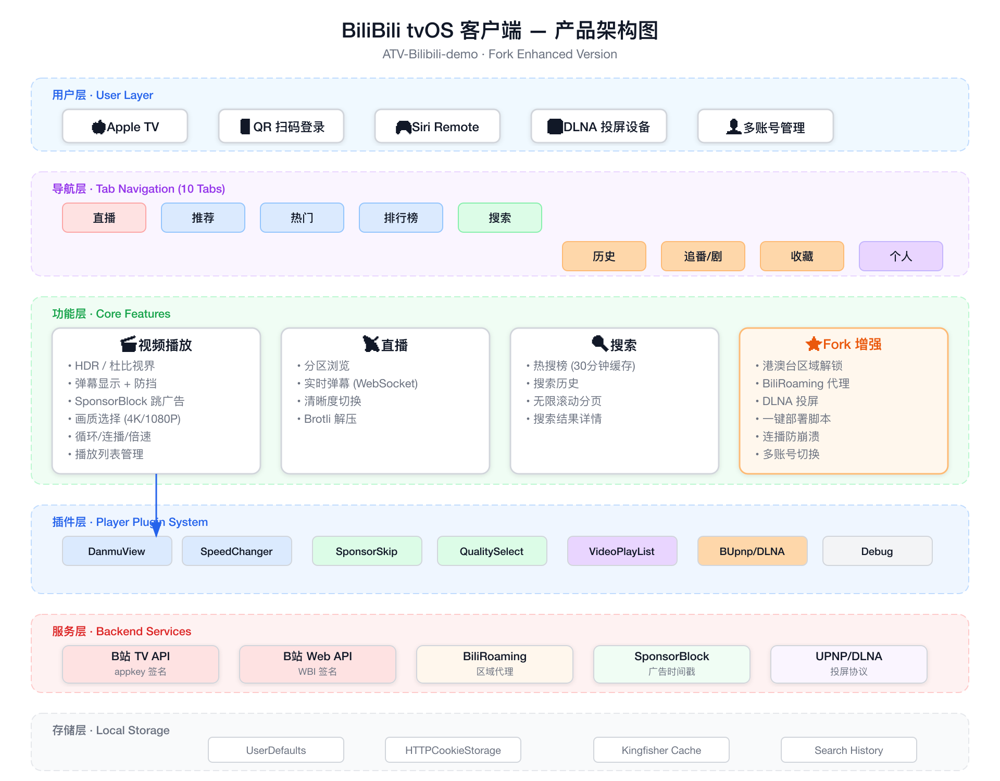
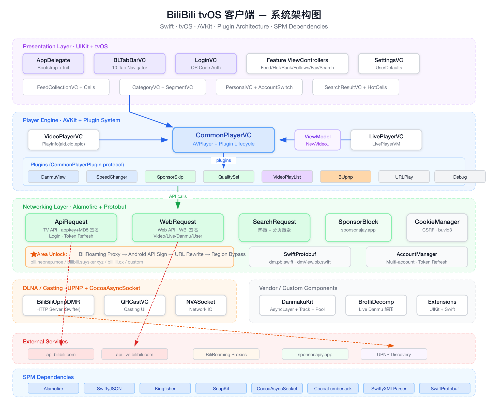

<h1 align="center">BiliBili tvOS 客户端</h1>

<p align="center">在 Apple TV 上享受完整的 B 站体验 —— 直播 · 弹幕 · HDR/杜比视界 · 港澳台解锁 · 一键部署</p>

<p align="center">
  
  
  
  
  <a href="https://t.me/appletvbilibilidemo"></a>
  <a href="https://github.com/DISSIDIA-986/ATV-Bilibili-demo/stargazers"></a>
</p>

<p align="center">
  
</p>

<p align="center"><strong>本项目没有任何授权的 Testflight 发放以及任何收费版本，请注意辨别安全性。</strong></p>

---

## 功能特性

### 核心功能
| 功能 | 说明 |
|------|------|
| 直播 | 实时弹幕、清晰度切换 |
| 视频 | 推荐/热门/排行榜、弹幕防挡、HDR/杜比视界 |
| 搜索 | 热搜榜、历史记录、分页加载 |
| 个人 | 历史记录、稍后再看、关注、收藏、投稿 |
| 投屏 | 云视听小电视协议支持 |

### 增强特性 (Fork 新增)
- **智能搜索** — B 站热搜榜 + 搜索历史 + 无限滚动分页
- **播放增强** — 循环模式、跳过片头片尾 (SponsorBlock)
- **港澳台解锁** — BiliRoaming 代理服务器，解除番剧区域限制
- **一键部署** — 免费开发者账号直接部署到 Apple TV，自动检测 tvOS SDK
- **弱网防卡顿** — 智能 CDN 选路（避开 G-Core/PCDN 慢节点）、持续卡顿自动降画质并换节点、加大缓冲、切画质保留进度
- **稳定性优化** — 连续播放防崩溃、安全模式、错误处理增强

---

## 截图

<table>
  <tr>
    <td width="50%" align="center">
      <br/>
      <sub><b>主导航 & 直播</b> — 9 个标签页 + 实时弹幕</sub>
    </td>
    <td width="50%" align="center">
      <br/>
      <sub><b>智能搜索</b> — 热搜榜 + 分页加载 + 历史记录</sub>
    </td>
  </tr>
  <tr>
    <td width="50%" align="center">
      <br/>
      <sub><b>番剧影视</b> — 区域解锁后的完整片库</sub>
    </td>
    <td width="50%" align="center">
      <br/>
      <sub><b>QR 码登录</b> — 扫码快速登录</sub>
    </td>
  </tr>
</table>

<sub>提示：弹幕防挡、清晰度切换、投屏等播放增强细节见顶部演示动画与下方架构图。</sub>

---

## 架构

<p align="center">
  
</p>
<p align="center"><em>产品架构图 — 功能模块与分层</em></p>

<p align="center">
  
</p>
<p align="center"><em>系统架构图 — 技术组件与数据流</em></p>

---

## 安装

### 未签名 IPA
从 [Releases](https://github.com/yichengchen/ATV-Bilibili-demo/releases/tag/nightly) 下载，使用 Sideloadly 或 AltStore 安装。

### 源码编译
```bash
# 克隆仓库
git clone https://github.com/DISSIDIA-986/ATV-Bilibili-demo.git
cd ATV-Bilibili-demo

# 使用 Fastlane 构建未签名 IPA
fastlane build_unsign_ipa
```

### 部署到 Apple TV（免费开发者账号）
```bash
# 一键部署（自动检测设备、构建、安装）
./scripts/deploy_to_appletv.sh

# 清理后重新构建
./scripts/deploy_to_appletv.sh --clean

# 查看已连接的 Apple TV
./scripts/deploy_to_appletv.sh --list
```
> 免费开发者账号签名的应用有效期 7 天，过期后重新运行脚本即可。脚本会自动下载缺失的 tvOS SDK。

---

## 社区

- Telegram: https://t.me/appletvbilibilidemo

---

## 致谢

- [thmatuza/MPEGDASHAVPlayerDemo](https://github.com/thmatuza/MPEGDASHAVPlayerDemo)
- [dreamCodeMan/B-webmask](https://github.com/dreamCodeMan/B-webmask)
- [分析Bilibili客户端的"哔哩必连"协议](https://xfangfang.github.io/028)
- App Icon: [【22娘×33娘】亲爱的UP主，你怎么还在咕咕咕？](https://www.bilibili.com/video/BV1AB4y1k7em)
