# 开发者账号签名IPA分发指南

## 📋 概述

本文档详细说明如何使用开发者账号为 ATV-Bilibili-demo 签名并分发给测试用户。

## 🔐 前提条件

### 必需的开发者账号
- **Apple Developer Program** 账号 ($99/年)
- 或 **Apple Developer Enterprise Program** 账号 ($299/年，仅限企业内部分发)

### 开发环境
- macOS 14.0+
- Xcode 15.0+
- 有效的开发者证书和描述文件

## 🚀 快速开始

### 一键签名 (推荐)
```bash
# 1. 编辑签名脚本配置
vim scripts/sign_ipa.sh

# 2. 设置必要参数
TEAM_ID="YOUR_TEAM_ID"          # 开发者团队ID
BUNDLE_ID="com.yourname.app"    # 唯一的Bundle标识符
EXPORT_METHOD="ad-hoc"          # 或 "enterprise"

# 3. 运行签名脚本
./scripts/sign_ipa.sh
```

## 🛠️ 签名方法

### 方法一：自动化签名脚本 (推荐)

项目提供了完整的自动化签名脚本，支持 Ad-hoc 和企业分发。

#### 配置步骤
1. **获取团队ID**: 登录 [Apple Developer Center](https://developer.apple.com) 查看
2. **设置唯一Bundle ID**: 如 `com.yourname.bilibiliive`
3. **选择分发方式**: `ad-hoc` 或 `enterprise`

#### 脚本特性
- ✅ 自动创建 ExportOptions.plist
- ✅ 自动Archive和导出IPA
- ✅ 文件完整性校验
- ✅ 详细的日志输出

### 方法二：Xcode Archive 签名

#### 1. 配置项目签名
1. 打开 `BilibiliLive.xcodeproj`
2. 选择项目 → Targets → BilibiliLive
3. 签名与功能 (Signing & Capabilities):
   - **Team**: 选择你的开发者团队
   - **Bundle Identifier**: 修改为唯一标识符
   - **Signing Certificate**: 选择合适的证书

#### 2. Archive 和导出
```bash
# 命令行 Archive
xcodebuild archive \
    -project BilibiliLive.xcodeproj \
    -scheme BilibiliLive \
    -destination 'generic/platform=tvOS' \
    -archivePath ./build/BilibiliLive.xcarchive

# 导出 IPA
xcodebuild -exportArchive \
    -archivePath ./build/BilibiliLive.xcarchive \
    -exportPath ./build \
    -exportOptionsPlist ExportOptions.plist
```

### 方法三：Fastlane 自动化

#### 安装和配置
```bash
# 安装 Fastlane
gem install fastlane

# 初始化配置
fastlane init
```

#### Fastfile 配置
```ruby
default_platform(:tvos)

platform :tvos do
  desc "Build signed IPA for Ad-hoc distribution"
  lane :build_adhoc do
    build_app(
      project: "BilibiliLive.xcodeproj",
      scheme: "BilibiliLive",
      destination: "generic/platform=tvOS",
      export_method: "ad-hoc",
      output_directory: "./build",
      output_name: "BilibiliLive-adhoc.ipa"
    )
  end
  
  desc "Build signed IPA for Enterprise distribution"
  lane :build_enterprise do
    build_app(
      project: "BilibiliLive.xcodeproj", 
      scheme: "BilibiliLive",
      destination: "generic/platform=tvOS",
      export_method: "enterprise",
      output_directory: "./build",
      output_name: "BilibiliLive-enterprise.ipa"
    )
  end
end
```

## 📱 分发方式选择

### 1. Ad-hoc 分发 (个人/组织开发者)

#### 适用场景
- 小规模测试 (最多100台设备)
- 内部测试团队
- Beta 版本分发

#### 要求
- 设备 UDID 必须预先注册
- 需要重新生成描述文件添加新设备

#### 获取 Apple TV UDID
| 方法 | 操作步骤 |
|------|----------|
| **Xcode** | Window → Devices and Simulators → 连接设备 |
| **Apple Configurator 2** | Mac App Store 下载 → 连接设备查看 |
| **设备设置** | 设置 → 通用 → 关于本机 → 标识符 |

### 2. 企业分发 (企业开发者账号)

#### 适用场景
- 大规模内部分发
- 企业内部应用
- 无需设备限制的场景

#### 优势
- ✅ 无设备数量限制
- ✅ 无需注册设备 UDID
- ✅ 支持无线安装
- ✅ 可通过 MDM 分发

#### 限制
- ⚠️ 仅限企业内部员工使用
- ⚠️ 不得向公众分发
- ⚠️ 需要企业开发者账号 ($299/年)

### 3. TestFlight 分发

#### ⚠️ 重要提醒
由于 ATV-Bilibili-demo 使用第三方 API，可能不符合 App Store 审核指南。TestFlight 分发存在审核风险。

#### 如果尝试 TestFlight
1. 提交到 App Store Connect
2. 内部测试 (最多25人，无需审核)
3. 外部测试需要苹果审核通过

## 📦 安装方法

### 方法一：Apple Configurator 2 (推荐)
1. 从 Mac App Store 下载 Apple Configurator 2
2. USB 连接 Apple TV 到 Mac
3. 选择设备 → 添加 → 应用
4. 选择签名后的 IPA 文件
5. 等待安装完成

### 方法二：Xcode 设备管理器
1. Xcode → Window → Devices and Simulators
2. 选择连接的 Apple TV
3. 点击 "+" 按钮添加应用
4. 选择 IPA 文件并安装

### 方法三：无线安装 (企业分发)

#### 创建 manifest.plist
```xml
<?xml version="1.0" encoding="UTF-8"?>
<!DOCTYPE plist PUBLIC "-//Apple//DTD PLIST 1.0//EN" "http://www.apple.com/DTDs/PropertyList-1.0.dtd">
<plist version="1.0">
<dict>
    <key>items</key>
    <array>
        <dict>
            <key>assets</key>
            <array>
                <dict>
                    <key>kind</key>
                    <string>software-package</string>
                    <key>url</key>
                    <string>https://your-server.com/BilibiliLive.ipa</string>
                </dict>
            </array>
            <key>metadata</key>
            <dict>
                <key>bundle-identifier</key>
                <string>com.yourname.bilibiliive</string>
                <key>bundle-version</key>
                <string>1.0</string>
                <key>kind</key>
                <string>software</string>
                <key>platform-identifier</key>
                <string>com.apple.platform.appletvos</string>
                <key>title</key>
                <string>BilibiliLive</string>
            </dict>
        </dict>
    </array>
</dict>
</plist>
```

#### 安装链接
```html
<a href="itms-services://?action=download-manifest&url=https://your-server.com/manifest.plist">
    安装 BilibiliLive
</a>
```

## 🔧 配置文件模板

### ExportOptions.plist (Ad-hoc)
```xml
<?xml version="1.0" encoding="UTF-8"?>
<!DOCTYPE plist PUBLIC "-//Apple//DTD PLIST 1.0//EN" "http://www.apple.com/DTDs/PropertyList-1.0.dtd">
<plist version="1.0">
<dict>
    <key>method</key>
    <string>ad-hoc</string>
    <key>teamID</key>
    <string>YOUR_TEAM_ID</string>
    <key>compileBitcode</key>
    <false/>
    <key>stripSwiftSymbols</key>
    <true/>
    <key>thinning</key>
    <string>&lt;none&gt;</string>
</dict>
</plist>
```

### ExportOptions.plist (Enterprise)
```xml
<?xml version="1.0" encoding="UTF-8"?>
<!DOCTYPE plist PUBLIC "-//Apple//DTD PLIST 1.0//EN" "http://www.apple.com/DTDs/PropertyList-1.0.dtd">
<plist version="1.0">
<dict>
    <key>method</key>
    <string>enterprise</string>
    <key>teamID</key>
    <string>YOUR_TEAM_ID</string>
    <key>compileBitcode</key>
    <false/>
    <key>stripSwiftSymbols</key>
    <true/>
</dict>
</plist>
```

## 🔍 故障排除

### 常见错误及解决方案

| 错误 | 原因 | 解决方案 |
|------|------|----------|
| Certificate has expired | 证书过期 | 在开发者中心更新证书 |
| Device not registered | 设备未注册 | 注册设备UDID并重新生成描述文件 |
| Bundle ID conflict | Bundle标识符冲突 | 修改为唯一的Bundle ID |
| Provisioning profile error | 描述文件问题 | 重新下载匹配的描述文件 |

### 调试命令

#### 查看签名信息
```bash
# 查看 IPA 签名详情
unzip -q BilibiliLive.ipa
codesign -dv --verbose=4 Payload/BilibiliLive.app

# 验证签名有效性
codesign --verify --verbose Payload/BilibiliLive.app

# 查看描述文件信息
security cms -D -i embedded.mobileprovision
```

#### 证书管理
```bash
# 查看本地证书
security find-identity -v -p codesigning

# 清理过期证书
# Xcode → Settings → Accounts → Download Manual Profiles
```

## 📋 分发清单

### 分发前检查
- [ ] 开发者账号状态正常
- [ ] 证书和描述文件有效
- [ ] Bundle ID 配置正确
- [ ] 测试设备已注册 (Ad-hoc)
- [ ] IPA 文件签名验证通过

### 分发包内容
- [ ] 签名后的 IPA 文件
- [ ] 安装说明文档
- [ ] 设备兼容性说明
- [ ] 功能特性介绍
- [ ] 已知问题列表

### 测试验证
- [ ] 在目标设备上安装测试
- [ ] 主要功能验证
- [ ] 网络连接测试
- [ ] 性能表现确认

## 📚 最佳实践

### 1. 版本管理
- 使用语义化版本号 (如: 1.2.3)
- 为每个版本创建 Git 标签
- 保留构建日志和签名记录

### 2. 安全管理
- 定期更新开发者证书
- 限制描述文件和私钥访问
- 使用安全渠道分发 IPA

### 3. 测试管理
- 建立测试设备清单
- 分阶段进行测试分发
- 收集详细的测试反馈

### 4. 自动化建议
- 集成到 CI/CD 流程
- 自动化测试验证
- 建立分发通知机制

## 🎯 完整分发流程

```mermaid
graph TD
    A[准备开发者账号] --> B[配置项目签名]
    B --> C[注册测试设备]
    C --> D[运行签名脚本]
    D --> E[验证IPA文件]
    E --> F[分发给测试用户]
    F --> G[收集测试反馈]
    G --> H[版本迭代]
```



### 详细步骤
1. **准备阶段**: 确保开发者账号、证书、设备注册完整
2. **构建阶段**: 使用自动化脚本或手动方式构建签名IPA
3. **验证阶段**: 测试 IPA 安装和基本功能
4. **分发阶段**: 通过安全渠道分发给测试用户
5. **反馈阶段**: 收集测试结果和用户反馈
6. **迭代阶段**: 根据反馈优化和发布新版本

---

## 📞 技术支持

### 相关资源
- [Apple Developer Documentation](https://developer.apple.com/documentation/)
- [Xcode User Guide](https://developer.apple.com/documentation/xcode)
- [fastlane Documentation](https://docs.fastlane.tools/)

### 项目支持
- GitHub Issues: 项目问题报告
- 部署文档: `docs/DEPLOYMENT.md`
- 开发脚本: `scripts/` 目录

### 社区支持
- Telegram 群组: https://t.me/appletvbilibilidemo
- 项目 Wiki 和 Discussions